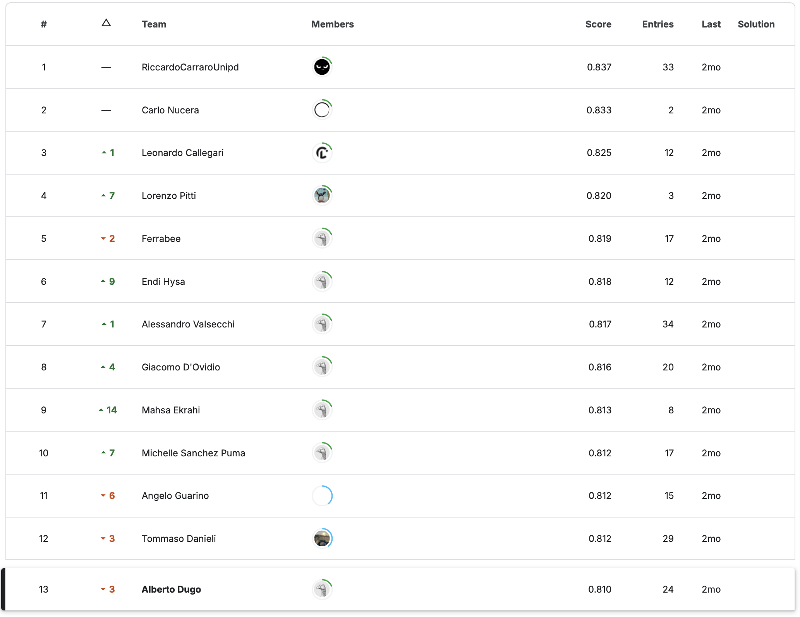
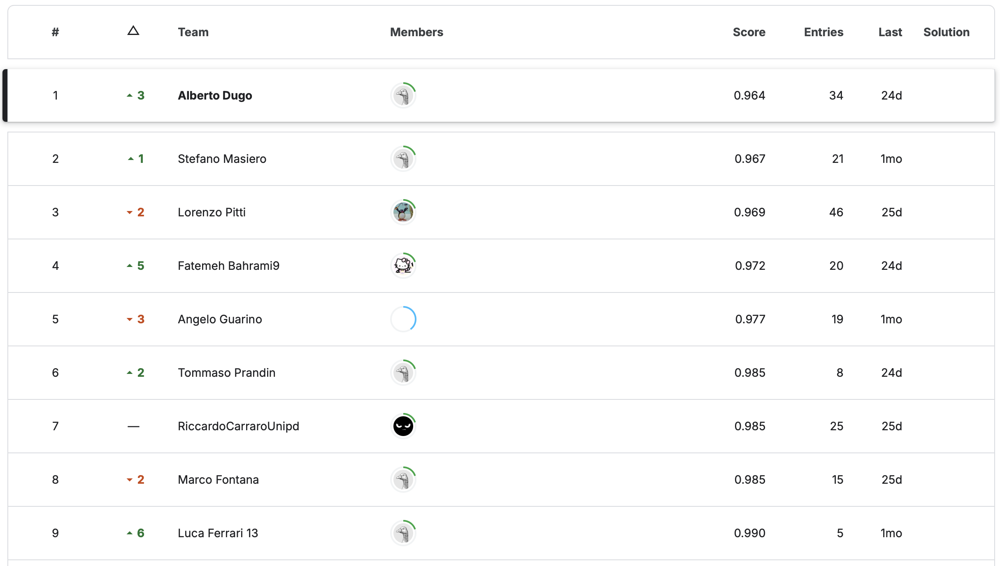

# Deep Learning Course Practical Assessment

This repository contains solutions for two practical challenges from the Deep Learning course assessment.

## Overview

* **Challenge 1: Image Classification**
  A practical assessment on building, training, and evaluating deep learning models for image classification tasks.
  Kaggle link: [https://www.kaggle.com/competitions/unipd-deep-learning-2025-challenge-1](https://www.kaggle.com/competitions/unipd-deep-learning-2025-challenge-1)

* **Challenge 2: Time-Series Modeling**
  A practical assessment on building, training, and evaluating deep learning models for sequential (time-series) data.
  Kaggle link: [https://www.kaggle.com/competitions/unipd-deep-learning-2025-challenge-2](https://www.kaggle.com/competitions/unipd-deep-learning-2025-challenge-2)

## Repository Structure

```
├── ensembleCNN.ipynb  # Notebook with solution for Challenge 1
├── weatherLSTM.ipynb           # Notebook with solution for Challenge 2
├── images_results/                                # Screenshots of model results (notebooks are inaccessible)
│   ├── challenge1_results.png
│   └── challenge2_results.png
└── README.md                              # This file
```

## Notebooks

> **Note:** For confidentiality reasons, the original Jupyter notebooks are not publicly accessible. Instead, this repository includes snapshots of key outputs.

* **`challenge1_image_classification.ipynb`**

  * Data loading and preprocessing
  * CNN architecture design and training logs
  * Evaluation: accuracy, confusion matrix, sample predictions

* **`challenge2_time_series.ipynb`**

  * Data preparation and windowing for sequence modeling
  * RNN/LSTM model design and training history
  * Evaluation: loss curves, forecast vs. ground truth plots

## Results

### Challenge 1: Image Classification



* Final test accuracy: **0.81%** the higher the best
* Best-performing model: Custom CNN with data augmentation

### Challenge 2: Time-Series Modeling



* Forecast RMSE on test set: **0.94** the lower the best
* Best-performing model: Stacked LSTM with dropout regularization
